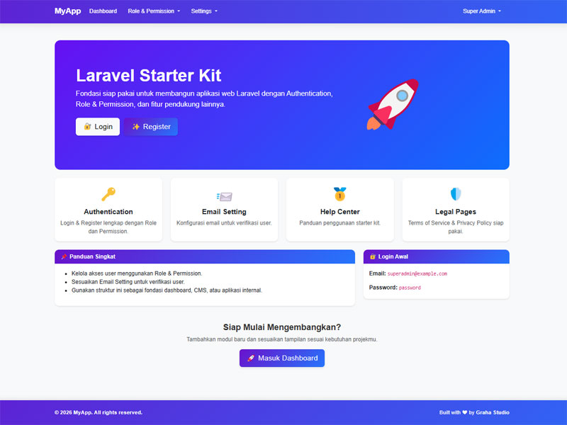
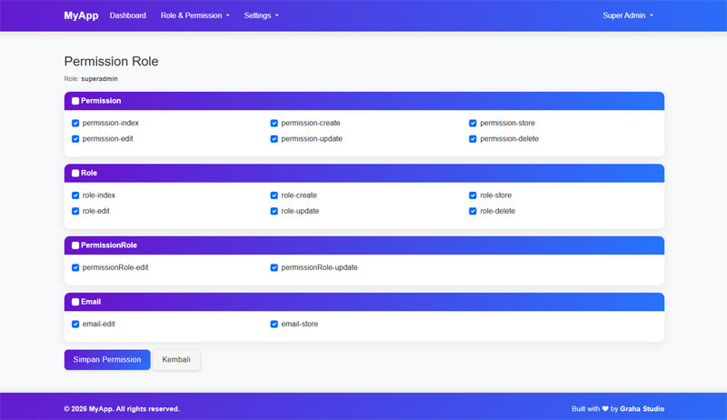

# Laravel Starter Kit

<p align="center" style="display: flex; justify-content: center; gap: 10px; flex-wrap: wrap;">
  <a href="https://php.net/"></a>
  <a href="https://packagist.org/packages/laravel/framework"></a>
  <a href="#"></a>
</p>

---

## Tentang Projek Ini

**Laravel Starter Kit** adalah starter kit Laravel untuk memulai projek aplikasi web.  
Projek ini sudah menyediakan fondasi siap pakai agar kamu bisa langsung mengembangkan berbagai fitur aplikasi dengan cepat.

### Fitur Utama yang Sudah Tersedia:

- ✅ **Authentication (Login/Register)**
- ✅ **Register dengan Verify Email**
- ✅ **Role & Permission Access**

> Starter kit ini dirancang agar mudah dikembangkan. Kamu bisa menambahkan modul baru, fitur tambahan, atau menyesuaikan tampilan sesuai kebutuhan projek kamu. Cocok untuk dashboard, CMS, e-commerce, atau aplikasi internal.

---

## Setup file .env

Buat file .env lalu copy semua yang ada di .env.example ke .env

```bash
DB_CONNECTION=sqlite
# DB_HOST=127.0.0.1
# DB_PORT=3306
# DB_DATABASE=laravel
# DB_USERNAME=root
# DB_PASSWORD=

QUEUE_CONNECTION=sync

```

> Jika menggunakan mysql ubah "DB_CONNECTION=mysql" hilangkan semua tanda #

---

## Instalasi

```bash
composer install
php artisan key:generate
php artisan migrate --seed
php artisan serve
```

Akases ke browser default : http://localhost:8000
Login menggunakan Akun

```bash
email : superadmin@example.com
pass  : password
```




